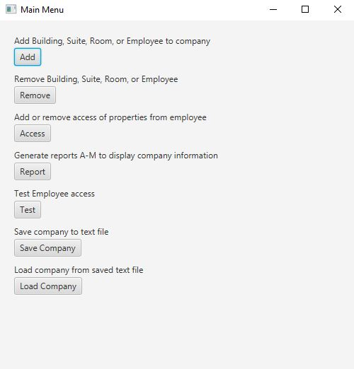

# Key Management System (2022)

A key management system (KMS) is needed to manage employees’ access to rooms in buildings where they work. Each employee has an electronic key-card which contains personal identifying information about them. When they encounter a door that is locked, they can insert their key-card into a card-reader on the door. The card-reader communicates with a central server to allow or disallow access. On the backend, the system provides services such as registering/removing employees, buildings, key-cards, assigning employees access to rooms (doors), etc. As well, various reports can be generated showing for example: who has accessed which rooms and when, etc.

This is a Gui based system that allows a user to manage buildings, suites, and rooms; employees; and employees access to buildings, suites, and rooms. The system also has a way to test an employee’s access to a room. Finally, the system can be used to generate various reports about access to rooms.
 
 

